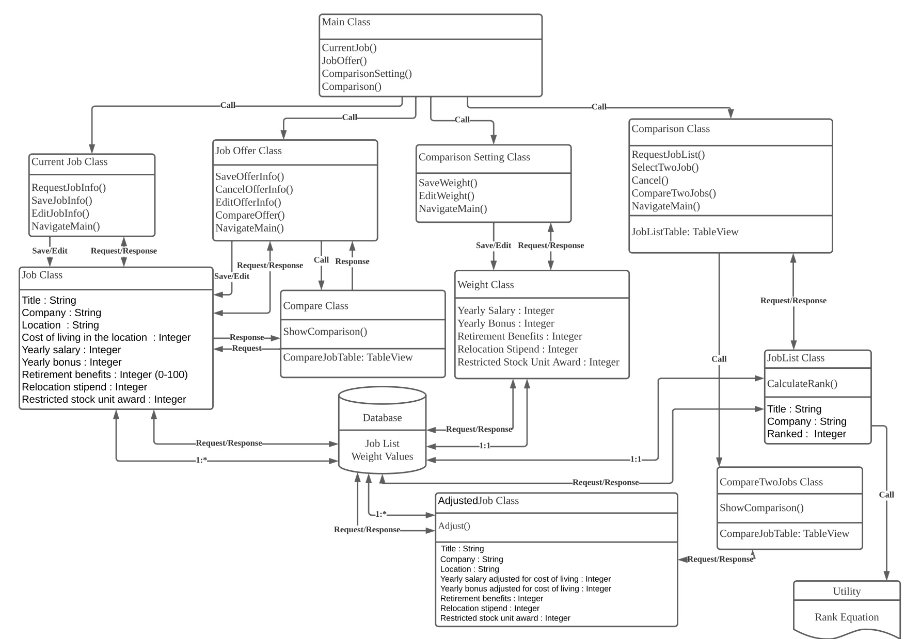

# Design 1 (ykim915)

- Pros: Design Diagram is well designed with a lot of details. The relationship between each entities are clearly expressed.
- Cons: UML diagram should only contains entities, attributes, functions and their relationships. It should not contain any UI related functions or database relations.

# Design 2 (Jin3048)

- Pros:  A simple diagram provides an intuitive part.
- Cons:  Some methods are not well understood. For example, it is difficult to understand the function 'purchase parking pass' represents. it is better to show about the property type. etc String, Int, Bool

# Design 3 (yjin392)

- Pros: Strictly followed the lecture videos. Initialized attributes in the comparisonSettings class. 
- Cons: There are some unnecassry class, like scores and also livingIndex. The diagram classes can be simplied and reduced.
- Others: Can be used as a reference for the UML deliverable. 

# Design 4 (yxia326)

- Pros:  It is a very well organized diagram and it is well explained about properties, methods, and relationships.
- Cons: Some think many get and sets related to method are good, but others think that it is expressed too much. It would be nice to be a little more concise.   

# Team Design

The team design diagram has four categories expressed as class: `User`, `Job`, `ComparisonSetting` and `System`. We believe that using this four classes can fulfill all the requirements specified in the documentation:
- `System` class is the core class that connects all other pieces, it stores all the users that registered in the app.
- `User` class will contain user's current job, all the job offers, and the comparison settings that he/she creates. And some functions that allow the user to perform various kinds of tasks.
- `Job` class contains all attributes of a job.
- `ComparisonSetting` class stores all the attributes weighting, that will be modified by a user.

This finalized design diagram is derived from Yu Xia's design diagram, except we removed all the getter and setter functions, and added a little bit details like initializing all the comparison settings. 

Yifan's design is also pretty close to the finalized one, but we decided to remove the `score` and `livingIndex` class. Because it's a little bit heavy-weighted to express them as classes, while those can be easily represented as attributes.

Young Kim's design covers all the requirements in the documentation, but contains many unnecessary stuff like UI operations and database relationships, which should not be expressed in a UML diagram.

# Summary

In summary, through this group discussion, we were able to get a lot of ideas from each other to create a concise and intuitive diagram. Each of us had the same thoughts, opinions, and views on system design, but there were also different parts, so it became a meaningful discussion to integrate them.

First of all, since we each live in different places and times, there may be inconveniences in conducting the discussion, but our entire team conducted simple communication before the discussion using a specific messenger (wechat), and in the discussion, we used the zoom tool to effectively A live video discussion was held.

Before the discussion, we made the necessary markdown file on Team Github in advance, prepared the diagram image of each team member and the form to fill out, and the discussion went smoothly. Although each of them had their own opinions at first, it became a diagram that developed through each other's diagrams and discussions. We think it is a great achievement in this discussion to make it concise and intuitive by re-establishing unnecessary functions, properties, and complex relationships.
