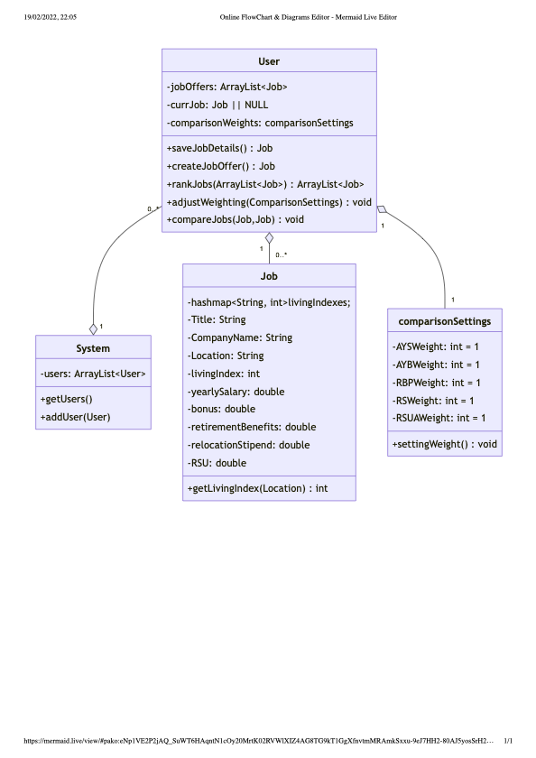
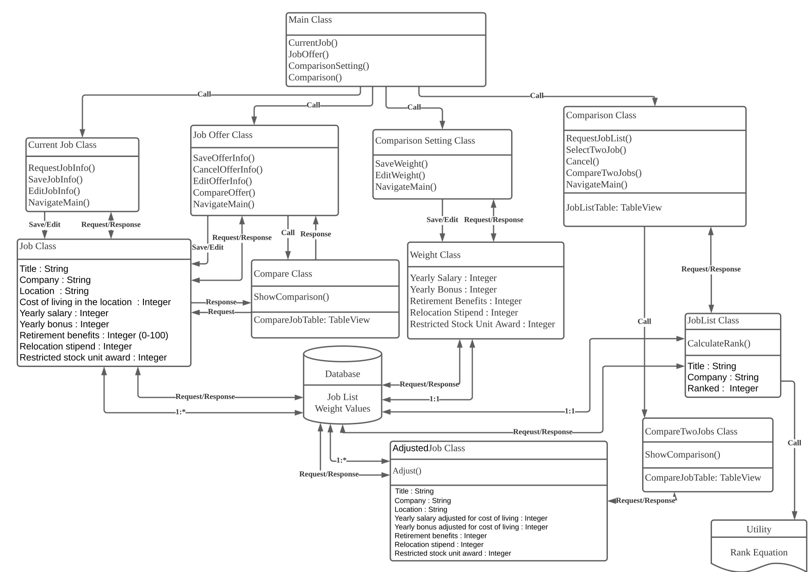
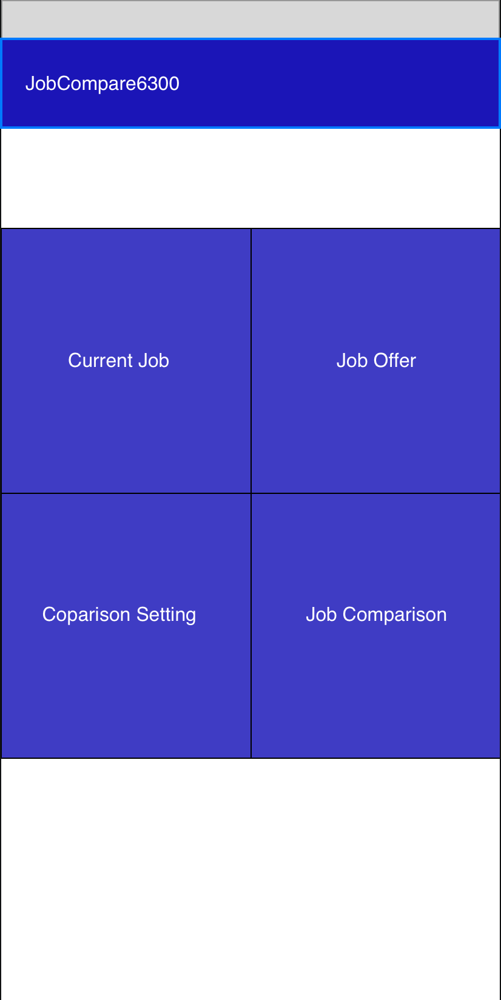
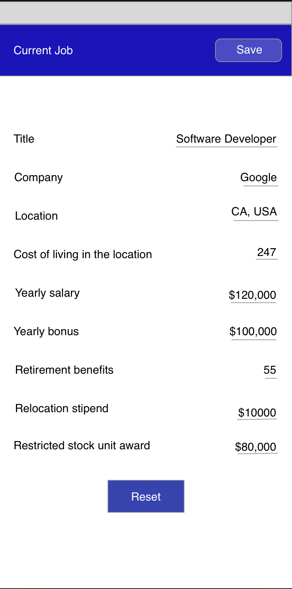
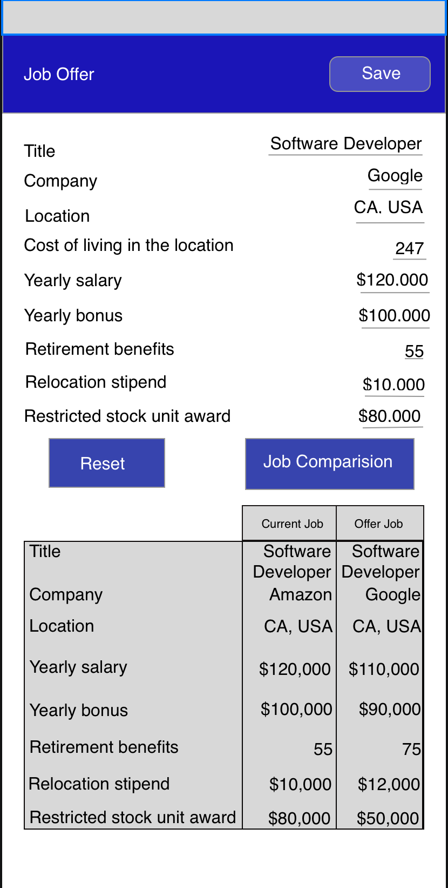
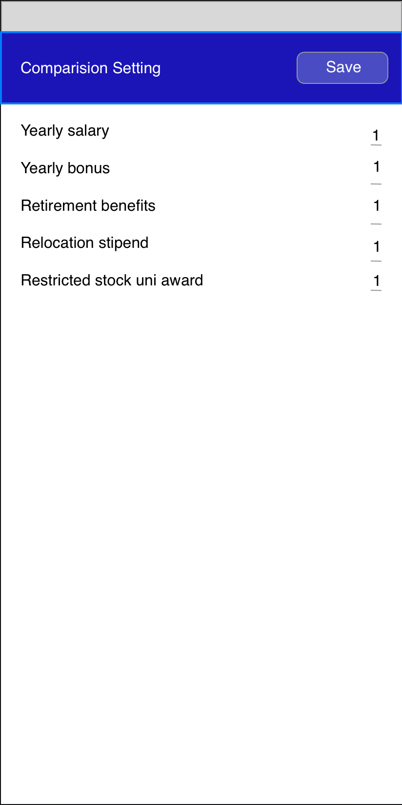
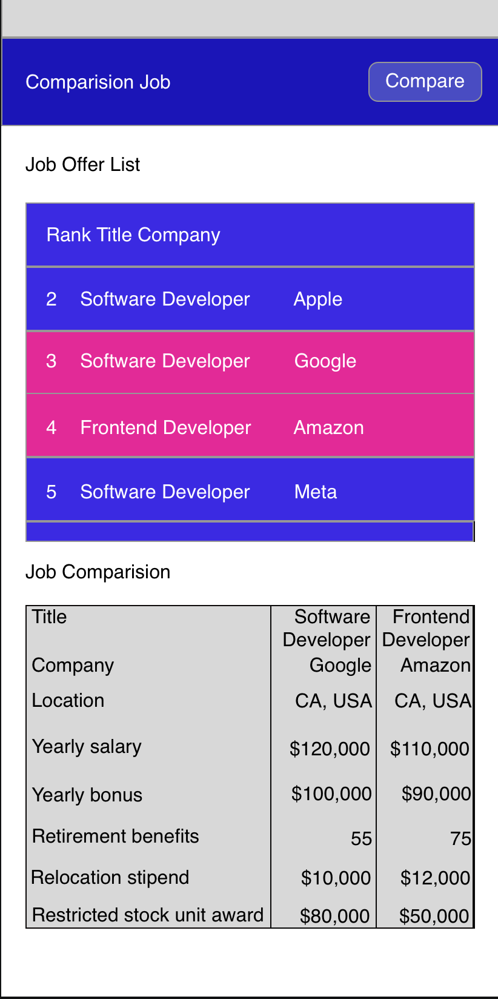

# Design Document
**Author**: Team007

## 1 Design Considerations

### 1.1 Assumptions
- The application is constructed using Java and Android Studio
- The application is an Android application and can only be operated in Android Devices
- This application is availbe to download and installed 
- There is at least 50mb space to install this application on the mobile.

### 1.2 Constraints

- The application state should persist between runs
- The application may be unavailable for some versions of Android systems, there is an Android version system requirement for this application. 
- Given the time constraint, the application will only has the basic functionalities described. 
- The comparison made between jobs only depends on the factors described, there might be other factors influencing the job score, we will not count other factors.
- A SQLite database supported by Android is used to store/edit persistent information.
- The minimum API level for this app should be “API 29: Android 10.0 (Q)”

### 1.3 System Environment

**Software Requirement:**

- This System should be operating based on Java SDK and Android Studio.
- No network connection required.
- This application should handle database.

**Hardware Requirement:**

- Screen size of about 5.5 inches
- 2 GB Ram, 4 GB Ram above (Recommended)

## 2 Architectural Design

*The architecture provides the high-level design view of a system and provides a basis for more detailed design work. These subsections describe the top-level components of the system you are building and their relationships.*

### 2.1 Component Diagram

### 2.2 Deployment Diagram

- All of the deployment will be on virtual machine on android studio, there is no other servers required, therefore, the deployment diagram is not necessary.
- The app's deployment diagram runs inside and handles its own database, as it happens within a hardware element that handles one Android OS.

## 3 Low-Level Design

### 3.1 Class Diagram

*In the case of an OO design, the internal structure of a software component would typically be expressed as a UML class diagram that represents the static class structure for the component and their relationships.*

The team design diagram has four categories expressed as class: `User`, `Job`, `ComparisonSetting` and `System`: 
- `System` class is the core class that connects all other pieces, it stores all the users that registered in the app.
- `User` class will contain user's current job, all the job offers, and the comparison settings that he/she creates. And some functions that allow the user to perform various kinds of tasks.
- `Job` class contains all attributes of a job.
- `ComparisonSetting` class stores all the attributes weighting, that will be modified by a user.

Intuitive UML design in Mobile UI - ViewController Class and DB Class  are also expressed.

## 4 User Interface Design
*For GUI-based systems, this section should provide the specific format/layout of the user interface of the system (e.g., in the form of graphical mockups).*

- Main screen (current job creation/edit button, job offer creation button, coparisonSetting button, job comparison button)

- Job creation/edit screen

- Job offer creation screen

- coparisonSetting screen

- Job comparison screen

