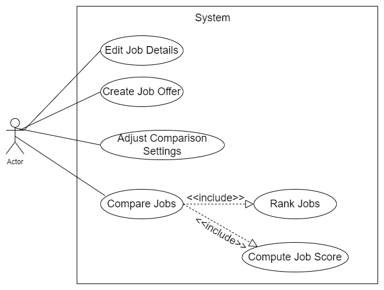

# Use Case Model

**Author**: Team007

## 1 Use Case Diagram

## 2 Use Case Descriptions

### Use Case 1：Edit Job Details
- Requirements: User should be able to edit job details;
- Pre-conditions: There must exist at least a job for the user to edit;
- Post-conditions: Job details should be updated with the newly entered information;
- Scenarios:
  - If user clicks "Save" button and all the fields are valid, then the current job details are updated with new information and screen should return to the main menu;
  - If user clicks "Save" button and some fields are invalid, then the screen should prompt appropriate error messages to let the user know what is going wrong;
  - If use clicks "Exit" button, then the screen should return to the main menu;

### Use Case 2：Create Job Offer
- Requirements: User should be able to enter new job offers;
- Pre-conditions: No pre-conditions;
- Post-conditions: A new job is created with correct job details;
- Scenarios:
  - If user clicks "Create" button and all the fields are valid, then a new job is created and added to user's profile;
  - If user clicks "Create" button and some fields are invalid, then the screen should prompt appropriate error messages to let the user know what is going wrong;
  - If user clicks "Cancel" button, then all the field values that already entered should clear out;
  - If user clicks "Exit" button, then the screen should return to the main menu;
  - If user clicks "Compare" button but current job details are not saved, then the screen should prompt a message said "Current job is not saved. Cannot Compare";
  - If user clicks "Compared" button and currrent job details are saved:
    - if user currently has a job, then the screen should locate to the new page containing the comparison information;
    - otherwise, a message should prompt in screen: "You currently don't have a job. Cannot compare."

### Use Case 3：Adjust Comparison Settings
- Requirements: User should be able to adjust his/her comparison settings;
- Pre-conditions: No pre-conditions;
- Post-conditions: User's comparison settings are updated with newly entered information;
- Scenarios:
  - If user clicks "Save" button and all the fields are valid, then the comparison settings are updated;
  - If user clicks "Save" button and some fields are invalid, then the screen should prompt appropriate error messages to let the user know what is going wrong;
  - If use clicks "Exit" button, then the screen should return to the previous page;

### Use Case 4：Compare Jobs
- Requirements: User should be able to compare two jobs;
- Pre-conditions: User should at least have two jobs to compare;
- Post-conditions: Screen should show the comparison information;
- Scenarios:
  - If user chooses two jobs and clicks "Compare" button, then a table should show on the screen with all the fields for each of the job;
  - If user clicks "Compare Others" button, then the screen should show the list of job offers the user currently have, waiting for user to choose and compare;
  - If use clicks "Exit" button, then the screen should return to the main menu;

### Use Case 5：Compute Job Score
- Requirements: The system should be able to calculate job score;
- Pre-conditions: No pre-conditions;
- Post-conditions: A score is calculated based on the given formula for the job;
- Scenarios:
  - This is an atomic task. No scenarios required;

### Use Case 6：Rank Jobs
- Requirements: The system should be able to rank jobs based on their scores;
- Pre-conditions: No pre-conditions;
- Post-conditions: A list of job offers are displayed ranked from best score to worst score;
- Scenarios:
  - This is an atomic task. No scenarios required;
